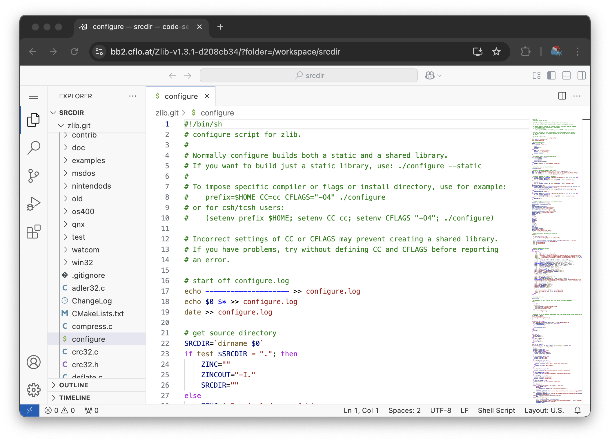

# Debugging with VSCode in the browser

Occasionally, a build is so complex and annoying that you wish you had the ability to open an IDE directly in the build environment and hack away at the code until it compiles.
This is now possible via the `launch_code_server` script, which, once invoked, downloads and sets up [a `code-server` instance](https://coder.com/docs/code-server), serving it both on the local machine at `http://localhost:8080`, and through a homemade tailscale funnel at `bb2.cflo.at`.
The tailscale funnel address will be printed out by the `launch_code_server` script, and is meant for use in debugging difficult-to-reproduce issues on CI servers and the like.
Opening a terminal in the vscode instance gives you the same shell prompt as the `--debug` session, including `bash` history with the commands from the build script.

## Future work

1. It would be nice to have a `--debug=vscode` flag to automatically run this, perhaps?  Following onto that, perhaps we can figure out a way to securely allow this in Yggdrasil so maintainers can debug difficult builds?
2. We should do something like `git init . && git add . && git commit -a -m "initial commit"` as part of this script, so that devs can easily see what changes they've applied to the source tree to get things to work.
3. There should be a blessed path to exfiltrate patches; perhaps something like an automatic `git format-patch` that uploads to a `gist` or something?
